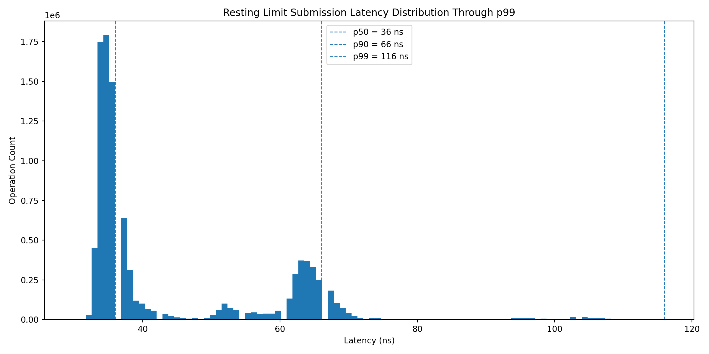
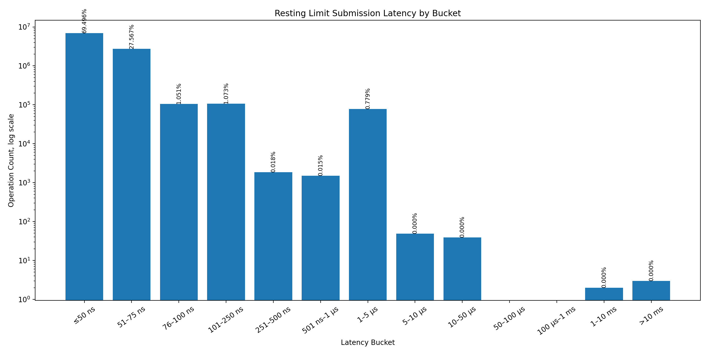

# C++ Matching Engine Version 2.0

## Contents

- [Overview](#overview)
- [Features](#features)
- [Quick Build](#quick-build)
- [Architecture](#architecture)
- [Benchmarking](#benchmarking)
- [Correctness and Testing](#correctness-and-testing)
- [Known Limitations](#known-limitations)
- [Future Work](#future-work)
- [References](#references)

## Overview

This project is my second attempt building a **high-performance limit order book** from scratch in C++, making use of features from the C++20 standard. It emphasizes **advancing the feature suite over version 1.0, a clean input and output API, and testing/performance harnesses for study**.

The project also implements a **binary parser** for a full day of downloaded **NASDAQ ITCH 5.0** trading data and a complimenting **market replay system** to provide **L1 and L2** book snapshots at specified times.

The engine processes buy/sell orders, **resting** them on **bid/ask price ladders**, respectively. Bids are ordered from **highest to lowest**, and asks are listed from **lowest to highest**. **FIFO** is used as its order-matching policy. Orders are **aggressive** when they take liquidity, meaning they **cross** the current **best bid** or **best ask** price. When aggressive, an order will take liquidity from the **opposite** price ladder (e.g., a buy order will consume shares from the ask ladder). Different **Time in Force** specifiers denote the exact execution path for limit orders.

I also detail a number of **optimizations** used to improve a baseline iteration of the order book, including their **hardware effects** (analyzed through `perf stat` and `perf record`) and **speedups**.

### Key Performance Analytics (On My Hardware)

- **p50 Limit Order Submission Latency:** 36ns
- **p99 Limit Order Submission Latency:** 116ns
- **p99.9 Limit Order Submission Latency:** 1.6μs

The bulk of recorded submission times linger **beneath 100ns/order**:





It is also important to recognize heightened tail latencies, for which raw data and analysis via `perf record` point to key causes (see [Future Work](#future-work)). The current reliance on `std::unordered_map` permits the use of separate chaining, causing access times to grow as the map fills, a likely contributor to spikes in latency.

## Features

- **Supported Order Types:** `Limit`, `Market`, `Cancel`, `Modify` 
- **Supported Time in Force:** `GTC`, `DAY`, `IOC`, `FOK`
- **132 Unit Tests with GoogleTest**
- **Benchmark Suite with GoogleBenchmark and Custom Latency-Recording Harness**
- **NASDAQ ITCH 5.0 Binary Parser**
- **Market Replay System with Adjustable Order Book Snapshots and L1/L2 Depth Readouts**
- **End of Trading Day Behaviour to Automatically Prune Day-Only Orders**
- **Neatly Packaged Request/Return API**
- **Custom Memory Pool Allocator** - Avoids hot path heap allocation
- **Dense std::vector-backed Price Ladders Favoured Over std::map** - Preserves cache locality of book data

## Quick Build

Quickly build and run unit tests:

```
cmake -S . -B build -DCMAKE_BUILD_TYPE=Debug -DLOB_BUILD_TESTS=ON
cmake --build build -j
ctest --test-dir build --output-on-failure
```

[Complete build and usage instructions](docs/general_usage_instructions.md)

## Architecture

In general, the book consumes one of several order **request** structures, defined in `include/lob/Requests.hpp`. The request is handled by **core logic** within `src/OrderBook.cpp`, routing to the proper order handler or being appropriately **rejected** (e.g., duplicate order ID). Based on the order's **side** (buy/sell), the order will **attempt to take liquidity from the opposite bid/ask ladder**. Price ladders, implemented in `src/core/PriceLadder.cpp`, are a **fixed-size linear map** of every available price. Each level on the ladder **corresponds to a particular price**, on which limit orders may currently **rest**. These levels, called PriceLevels in my implementation (and implemented in `src/core/PriceLevel.cpp`), are a wrapper for a **FIFO-ordered intrusive doubly linked list** and contain standard linked list and queue operations (e.g., push, pop, remove). RestingOrders are the **order objects stored on each price level** and are defined in `src/core/RestingOrder.hpp`. They strip out non-essential order data (e.g., price becomes implicit when resting) and add `prev`/`next` pointers for linked list operations.

```
+---------------+
|   OrderBook   |
|  request API  |
+-------+-------+
        |
        v
+------------------+
| Request handling |
| and match logic  |
+--------+---------+
         |
         +-----------------+
         |                 |
         v                 v
+--------------+   +--------------+
|  Bid Ladder  |   |  Ask Ladder  |
| dense prices |   | dense prices |
+-------+------+   +-------+------+
        |                  |
        v                  v
+--------------+   +--------------+
| Price Levels |   | Price Levels |
| FIFO orders  |   | FIFO orders  |
+-------+------+   +-------+------+
        |                  |
        +---------+--------+
                  |
                  v
         +----------------+
         | Resting Orders |
         | backed by pool |
         +----------------+
```

## Benchmarking and Optimization

My benchmarking suite has been separated into `bench/individual_behaviours` and `bench/latency`. They measure throughput (orders per second) and submission-to-completion latency (nanoseconds), respectively. Throughput measurements utilize GoogleBenchmark, whereas latency measurements make use of a simple custom harness that uses `std::chrono` and a steady clock for readings.

The results extracted from the `bench/` directory directly motivate downstream design decisions in order to optimize performance. I augment these readings using Linux's `perf stat` and `perf record`, though `perf stat` with GoogleBenchmark introduces immense noise from benchmark harness and setup/teardown.

[More on my benchmarking environment](docs/benchmarking_environment.md)

[About optimizations](docs/optimizations.md)

### Key Specs:

- **CPU:** Intel Core Ultra 7 155H
- **Maximum CPU Clock Frequency:** 4.50 GHz
- **OS:** Ubuntu 24.04
- **Compiler:** g++ 13.3.0
- **C++ Standard:** C++20

## Correctness and Testing

Powered by GoogleTest, I've written 132 unit tests to verify core and public order book functionality.

### Invariants to Uphold

- Order IDs are unique
- A particular level's volume is equal to the sum of each order's quantity currently resting on that level
- Best bid/ask are updated when the corresponding price level is emptied
- Executed/cancelled orders have their IDs removed from the ID-to-order map
- Memory pool expands with new volume and properly frees its owned memory

[More on the unit test suite](docs/test_methodology.md)

## Known Limitations

- Currently only single-threaded
- Price ladders are locked to fixed price range
- ITCH 5.0 replay only deals with one symbol
- ITCH 5.0 replay supports only core visible-book lifecycle messages
- Existing data structures demonstrating need for re-evaluation (e.g. `std::unordered_map` illustrating expensive rehash operations, std::vector part of SubmissionResult type on hot path).

## Future Work

- **Look into reasons that an ITCH 5.0 message might fail to be parsed.** Although rejection cases are well defined within the order book's replay request handling, an actual analysis of the NASDAQ market data would reveal precisely when fail (e.g. out of permissible price range).
- **Expand the latency measurement suite.** Currently, it only covers resting limit order submission latency on a fixed price range, though other submission parameters and order types should be recorded as well.
- **Sample and study real market data before implementation.** Market volatility and participant behaviour affect the types of orders submitted for a particular asset. It would have made for a considerably more genuine implementation if I had considered this, perhaps justifying different data structures.
- **Apply and study further optimizations.** FOK orders are a major performance hotspot - the current two pass solution to verify existing liquidity is computationally expensive. The core `std::unordered_map` may also be subject to refactor as `perf record` signals massive rehashing costs, even on simple resting limit order submissions.
- **Implement network parsing on live data feeds.** Ideally, reliance on old, downloaded NASDAQ exchange data can be replaced with the actual ITCH 5.0 live feed (definitely need to read more on network programming before I can implement this).

## References

- **Trading and Exchanges: Market Microstructure for Practitioners by Larry Harris** (selected chapters)
- [Coding Jesus' public multi-type order book implementation](https://github.com/Tzadiko/Orderbook) and his video [Understand the orderbook like a quant](https://www.youtube.com/watch?v=C24m5WEYWxE&t=42s)
- [Mansoor Mamnoon's limit order book implementation](https://github.com/mansoor-mamnoon/limit-order-book)
- [Trading at light speed: designing low latency systems in C++ - David Gross - Meeting C++ 2022](https://www.youtube.com/watch?v=8uAW5FQtcvE&t=1419s)
- [When Nanoseconds Matter: Ultrafast Trading Systems in C++ - David Gross - CppCon 2024](https://www.youtube.com/watch?v=sX2nF1fW7kI)
- [CppCon 2017: Carl Cook “When a Microsecond Is an Eternity: High Performance Trading Systems in C++”](https://www.youtube.com/watch?v=NH1Tta7purM&t=979s)