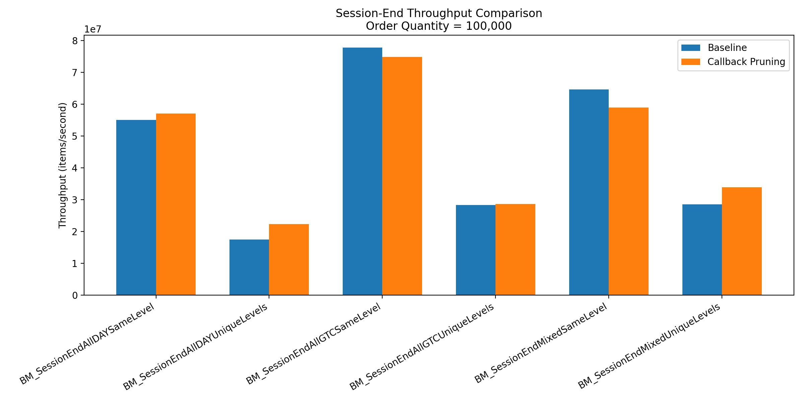
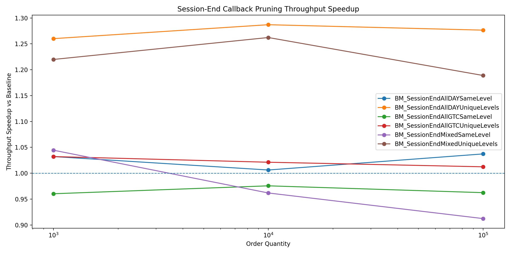
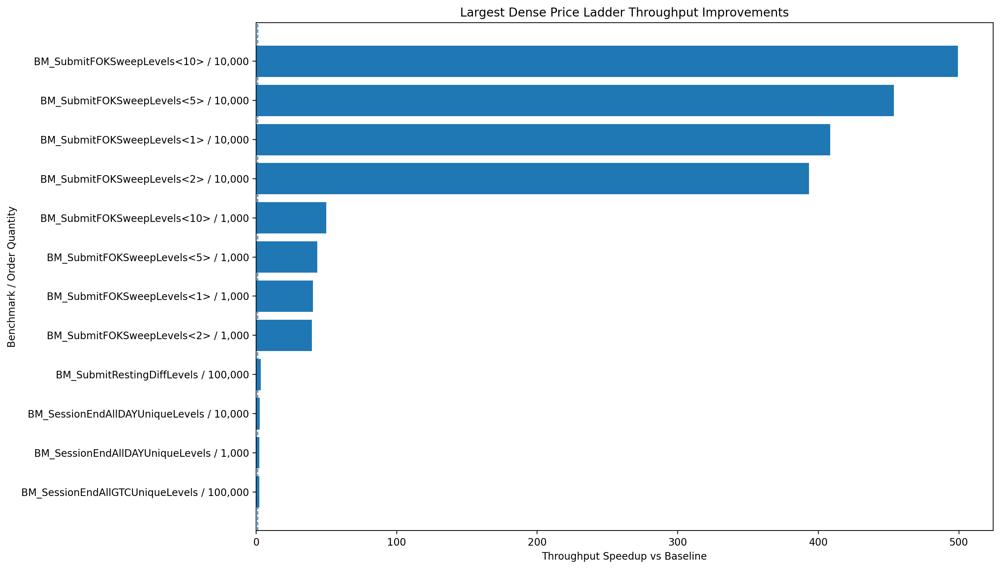
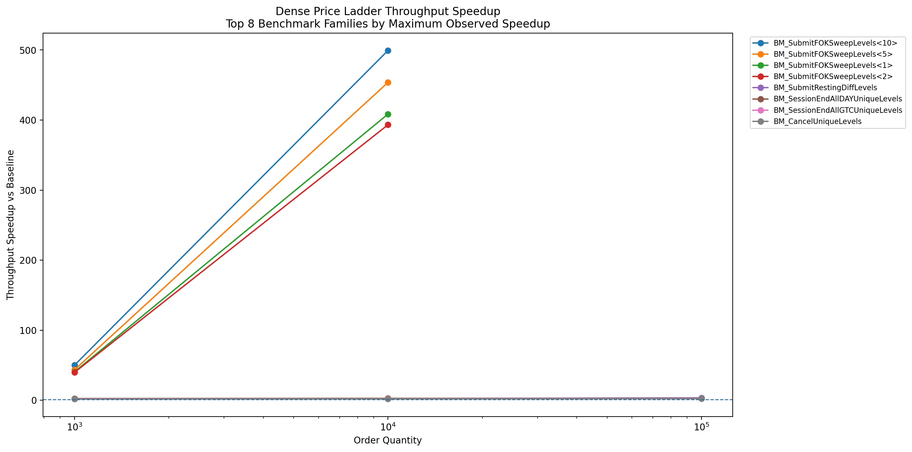

# Optimizations

The following document details attempts at optimizations made throughout development, progressively improving over a baseline model. Two substantial refactors have been made so far:

1. Forwarded callbacks to replace hot path `std::vector` during session end operations
2. Dense `std::vector` price ladders to replace `std::map`

In order to make a performance-enhancing change, I need to see proof of unstable throughput, time-consuming procedures, or costly hardware failures (e.g., page faults) via `perf stat` and `perf record`.

## 1. Session End Callback Pruning

The order book supports DAY orders, which must be removed when a trading session ends. The original implementation handled this by having lower-level price structures identify expired orders and return them upward in an intermediate container, `src/core/LevelPruneStats.hpp`. Initially, this involved the LevelPruneStats container built an `std::vector` of pruned orders so the OrderBook layer could retire them (remove them from the ID map and deallocate their memory).

That design was clean from an ownership perspective, but it introduced unnecessary work in a path that can touch a large portion of the book. During profiling, `perf record` attributed a noticeable portion of session-end runtime, roughly **5%** in the observed profile, to std::vector allocator activity. Factoring in noise from GoogleBenchmark's harness, which is automatically included by `perf record`, suggests that a more significant portion of runtime is consumed by `std::vector`'s heap allocation. 

The optimized implementation replaced the intermediate vector with a **callback-based pruning path**. Instead of returning a container of orders to be pruned, each PriceLevel **accepts a callback** and invokes it immediately when a DAY order is marked for removal. The OrderBook passes a callback that calls its existing `retire_order()` helper, allowing the removed order to be erased from `idToOrderMap_` and returned to the memory pool at the point of pruning.

This reduced temporary allocation pressure and eliminated an extra collection/iteration step. The **tradeoff is that the lower-level pruning function is now templated on a callback and is slightly less isolated from the OrderBook retirement policy**.

The benchmark results show that this change helped most when session-end pruning involved orders spread across several price levels. In the unique-level session-end benchmarks, the callback-based approach reached speedups of up to roughly **1.3x**.

The same-level session-end cases showed small slowdowns in some measurements. That result is not especially surprising: when all DAY orders are concentrated at a single price level, the old vector-based implementation has less price-level traversal and collection overhead to amortize, while the callback path still pays the cost of per-order callback invocation. In realistic book states, however, DAY interest is more likely to be distributed across multiple price levels rather than concentrated entirely at one level, so the unique-level behavior is the more relevant stress case for this optimization.

The per-order-quantity throughput comparisons show the same pattern: the callback design is most valuable in the workloads where pruning work is distributed across many levels, while same-level workloads are closer to neutral.

## 2. Dense Price Ladders

The original order book stored price levels sparsely using `std::map`. That design was flexible and convenient as `std::map`'s internal tree structure orders existing price levels using template parameters `std::less` and `std::greater` - an ideal combination for bid/ask ladders. However, being a node-based linked structure, nodes populate memory sparsely and certain accesses are not favourable for **data cache** access and **access prediction**.

The clearest symptom appeared in most benchmarks that manipulated orders across different price levels. Under the old representation, throughput dropped sharply as the number of touched levels increased. This is visible when viewing raw throughput data from the baseline order book available in `results/throughput/base/base.json` - the same benchmark's performance may collapse as the number of orders/swept levels is increased. `perf stat` also pointed toward a memory-system problem rather than only a local instruction-count problem: multi-level workloads showed noticeably worse cache behavior and **increased page-fault activity** compared with denser same-level workloads. This suggested that the sparse price level structure was stressing **data locality and allocation behavior in the hot path**.

`perf record` supported the same interpretation. The hottest paths were not dominated by matching arithmetic itself, but by container lookup and bookkeeping around price-level access. 

The optimized design replaces sparse price-level storage with a dense `PriceLadder`, now implemented in `src/core/PriceLadder.cpp`. Since the order book already operates on integer fixed-point prices, the price-level lookup could be made much more direct if the book were configured with a valid price range. On OrderBook construction, a price range is passed as config data and used to construct a `std::vector`. It offers contiguous storage for `PriceLevel` objects and, because it never resizes during use, no costly heap allocation is incurred.

This takes on several important **tradeoffs**: unnecessary heap allocation is mitigated and its density preserves cache locality for stored data at the cost of worsened algorithmic time complexity on several operations. Linear scans of the ladder become necessary as pointers to the best bids/asks (stored as `std::optional` objects) need to be refreshed after the creation/emptying of a new price level. As demonstrated, despite its reliance on linear operations, serious speedups and improved consistency have been achieved.

The plots indicate that FOK orders were the most positively impacted by the changes. FOK orders are the most computationally expensive to process as they may require (at maximum) two scans of the entire price ladder to verify the existence of sufficient marketable liquidity. The previous `std::map`-backed implementation, using nodes for each price level scattered throughout memory, forced expensive memory-recall operations during traversal. Because the `std::vector`-backed implementation stores each PriceLevel sequentially in memory, linear lookups are **fast and predictable**. For FOK orders, the result is speedups reaching upwards of **500x** on very sparse books.

This refactor also seems to have had a **positive impact on most operations** touching more than one PriceLevel, with speedups > 1 observed.

Overall, the dense price ladder was the **most important structural optimization in the project**. It replaced a flexible sparse representation with a range-aware dense representation, **improving the hot path** for realistic multi-level order book workloads while **accepting the explicit tradeoff of configured price bounds**.